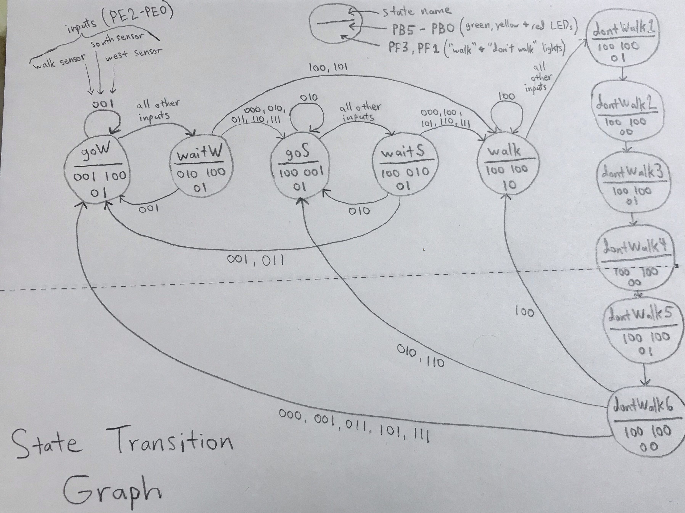
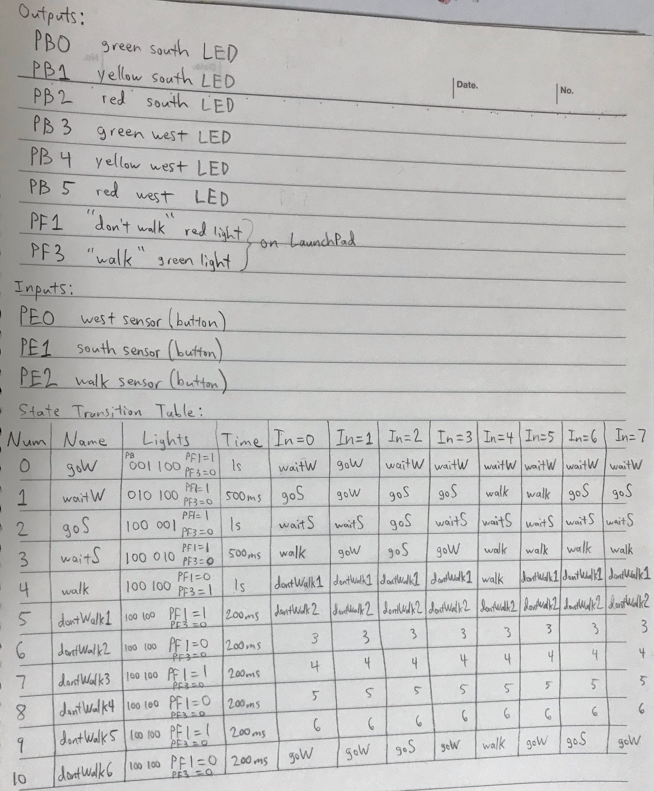
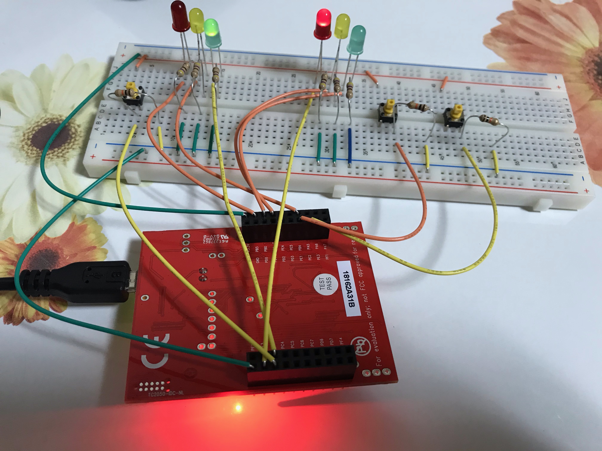
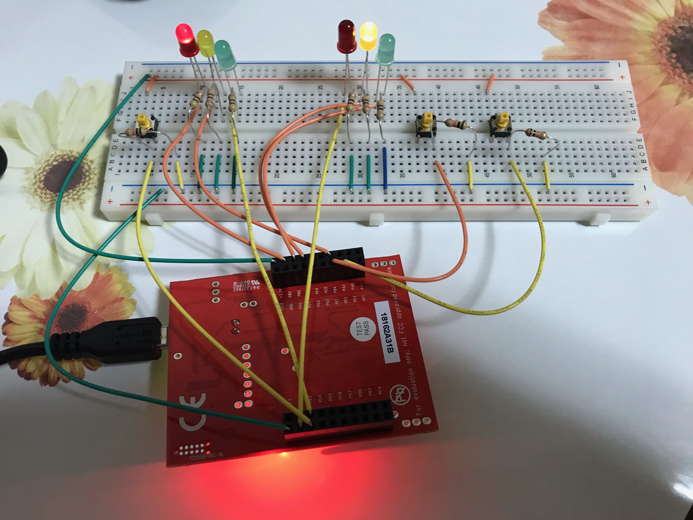
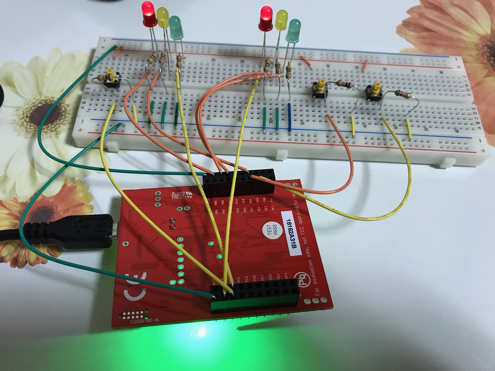

# Traffic Light

This program displays LEDs for 2 traffic lights for a simulated road running east-west and another road running north-south. There is also a simulated crosswalk simulated by a green and red LED on the Launchpad. There are 3 switches for each of the sets of lights. Pressing a switch simulates a sensor sensing that there is traffic on that road/crosswalk. Once the corresponding light turns to green it will stay there unless another sensor senses traffic or the current sensor no longer senses traffic. If there is traffic on 2 roads or a road and a crosswalk, then green lights will alternate between those 2. If all the sensors are active or if none of them are active then the green lights alternate between all 3. Yellow lights always follow green lights for the roads and the green light on the crosswalk is followed by a flashing red light meaning "Hurry Up!".

This traffic light simulation was programmed using a Moore finite state machine. There are 9 different states including goWest (green light), waitWest (yellow light), goSouth (green light), waitSouth (yellow light), walk (green light for crosswalk), and dontWalk1 - dontWalk6 which implements a flashing red light for the crosswalk. When there is a green or yellow light, all other lights must be red.

## System Requirements

TM4C123GH6PM Microcontroller

## State Transition Graph

## State Transition Table / Pins Used for Input and Output

## Example Usage

First, no sensors are active. Then I press the button for the crosswalk, then the west light, then the south light, then the west and south lights combined, and finally all 3 combined.

West light is green, and south and crosswalk lights are red.

South light is yellow, and west and crosswalk lights are red.

Crosswalk light is green, and west and south lights are red.

